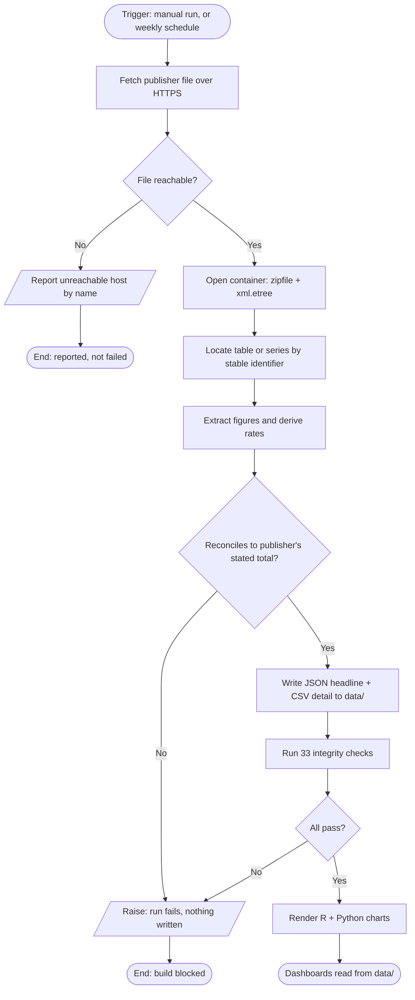
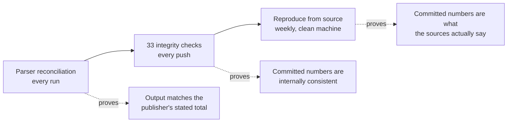

# Data Pipeline

**Project:** Australian open-data dashboard suite
**Version:** 1.0

Process model, data dictionary and the reconciliation rules that hold the whole
thing together.

---

## 1. Process model

The same seven steps run for each of the four sources. The gateway at step 5 is
the point of the design: nothing is written until the figures reconcile.

Two things are deliberate in that diagram.

**The gateway at G comes before the write, not after it.** A parser that wrote
first and validated second would leave a wrong file on disk for the next step to
pick up.

**The unreachable branch at C ends differently from the reconciliation branch at
G.** A government host refusing a datacentre IP is not a data defect, and
treating it as a build failure would train the maintainer to ignore red checks.
A figure that does not reconcile is a data defect, and it blocks the build.

### 1.1 Where each step lives

| Step | Implementation |
| :--- | :--- |
| Fetch | `scripts/common.py`, `get()` |
| Open container | `scripts/xlsx_reader.py`, `scripts/docx_reader.py` |
| Locate | `find_row`, `sheet_targets` (Excel); `find_table`, `row_starting` (Word) |
| Extract and derive | `scripts/fetch_*.py`, one per source |
| Reconcile | assertion inside each `fetch_*.py`, before any write |
| Write | `scripts/common.py`, `write_json()` and `write_csv()` |
| Verify | `tests/test_data_integrity.py` |
| Re-derive | `scripts/reproduce_check.py` |
| Orchestrate | `scripts/run_all.py` |

---

## 2. Sources

| Source | Publisher | Format | Cadence | Reference |
| :--- | :--- | :--- | :--- | :--- |
| Counts of Australian Businesses (8165.0), `8165DC01.xlsx` | ABS | Excel datacube | Annual | 2024-25 |
| Retail Trade (8501.0), series `A3348585R` and table `850103` | ABS | Excel time series | Monthly | June 2025 |
| Campaign Advertising Report 2023-24 | Dept of Finance | Word | Annual | 2023-24 |
| 2026 Update, GST Revenue Sharing Relativities | CGC | Word, ~17 MB | Annual | 2026-27 |

---

## 3. Data dictionary

### 3.1 `business_churn.json`

| Field | Type | Description | Source |
| :--- | :--- | :--- | :--- |
| `release` | string | Publication label | Literal |
| `reference_period` | string | ABS reference period | Literal |
| `source_file` | string | Direct URL to the datacube | Literal |
| `total_businesses` | integer | Businesses operating at 30 June | Table 4 |
| `flows.opening_stock` | integer | Businesses at start of period | Table 4 |
| `flows.entries` | integer | New businesses | Table 4 |
| `flows.exits` | integer | Business closures | Table 4 |
| `flows.entry_rate_pct` | float | Entries over opening stock | Derived |
| `flows.exits_rate_pct` | float | Exits over opening stock | Derived |
| `flows.net` | integer | Entries less exits | Derived |
| `survival_national.survival_3yr_pct` | float | Three-year survival | Table 5 |
| `survival_national.survival_4yr_pct` | float | Four-year survival | Table 5 |
| `by_state[].businesses` | integer | Count by state | Table 4 |
| `by_state[].share_pct` | float | Share of national | Derived |

Companion CSVs: `business_churn_by_state.csv`,
`business_survival_by_state.csv`, `business_survival_by_industry.csv`.

### 3.2 `govt_ad_spend.json`

| Field | Type | Description |
| :--- | :--- | :--- |
| `financial_year` | string | Reporting year, 2023-24 |
| `media_placement_total_m` | float | Published total, $173.8M |
| `by_channel[].channel` | string | One of seven channels |
| `by_channel[].spend_m` | float | Expenditure in $M |
| `by_channel[].share_pct` | float | Share of total, derived |
| `by_audience[].segment` | string | Regional, Ethnic or First Nations |
| `by_audience[].spend_m` | float | Targeted expenditure in $M |
| `audience_note` | string | States that segments are cuts, not channels |

`audience_note` is a field rather than a code comment because the distinction it
records is the one a reader is most likely to get wrong.

### 3.3 `retail_demand.json`

| Field | Type | Description |
| :--- | :--- | :--- |
| `series_id` | string | ABS Series ID, `A3348585R` |
| `series_type` | string | Seasonally Adjusted |
| `headline.turnover_m` | float | Latest monthly turnover, $M |
| `headline.mom_pct` | float | Month on month, derived |
| `headline.yoy_pct` | float | Year on year, derived |
| `series[].period` | string | `YYYY-MM` |
| `series[].turnover_m` | float | Monthly turnover, $M |
| `by_state[].turnover_m` | float | State turnover, $M |
| `by_state[].yoy_pct` | float | State year-on-year growth |

The parser reads the published series from the workbook and retains the most
recent 25 observations, which gives 24 month-on-month changes and a full
year-on-year comparison.

### 3.4 `gst_reconciliation.json`

| Field | Type | Description |
| :--- | :--- | :--- |
| `reference_year` | string | 2026-27 |
| `pool_bn` | float | GST pool, $102.52bn |
| `no_worse_off_bn` | float | No-worse-off payment, $5.04bn, outside the pool |
| `by_state[].gst_bn` | float | Distribution by state, $bn |
| `by_state[].share_pct` | float | Share of pool |
| `relativities[].relativity` | float | GST relativity |

---

## 4. Reconciliation rules

Each rule runs before any file is written. A failure raises and the run stops.

| Dataset | Rule | Tolerance |
| :--- | :--- | :--- |
| Business churn | State counts sum to national total | Exact |
| Business churn | State shares sum to 100% | ±0.2pp |
| Business churn | Four-year survival never exceeds three-year | Exact |
| Advertising | Channel spend sums to published total | ±$0.05M |
| Advertising | No audience segment appears among channels | Exact |
| Retail | State turnover sums to national headline | ±0.5% |
| Retail | Year-on-year recomputed from series matches headline | ±0.1pp |
| Retail | Periods are chronological | Exact |
| GST | State distribution sums to the pool | ±$0.01bn |
| GST | Shares sum to 100% | ±0.3pp |
| GST | All eight jurisdictions present | Exact |

Tolerances follow the publisher's own rounding. The ABS publishes state retail
turnover rounded to $0.1M, so an exact sum is not achievable and a 0.5% band
reflects the rounding rather than excusing an error.

---

## 5. Verification layers

The third layer is the one that costs something. The first two can both be
satisfied by a dataset that is consistently wrong; only re-downloading the
publisher's file and re-deriving from it distinguishes a correct dataset from a
carefully wrong one.

**Coverage caveat.** On GitHub's runners the weekly job re-derives 2 of 4
sources. `cgc.gov.au` and `finance.gov.au` do not answer datacentre ranges at
all, so the job names them as unreachable rather than failing. From an ordinary
connection `python scripts/reproduce_check.py` re-derives 4 of 4
byte-identically.

---

## 6. Downstream models

| Layer | Location | Contents |
| :--- | :--- | :--- |
| SQL | `sql/analysis.sql` | Models the four datasets and reproduces each headline metric |
| Power BI | `powerbi/` | TMDL semantic model, 15 DAX measures, star schema on a conformed `State` dimension |
| Supabase | `supabase/` | Postgres schema with row-level security, read-only anonymous access |
| R | `analysis/` | ggplot2 figures, exponential survival model, Quarto report |
| Python | `scripts/make_charts.py` | matplotlib figures |

`State` is the conformed dimension across all four datasets, which is what makes
the cross-dataset comparisons possible: business counts, retail turnover and GST
distribution all resolve to the same eight jurisdictions.
